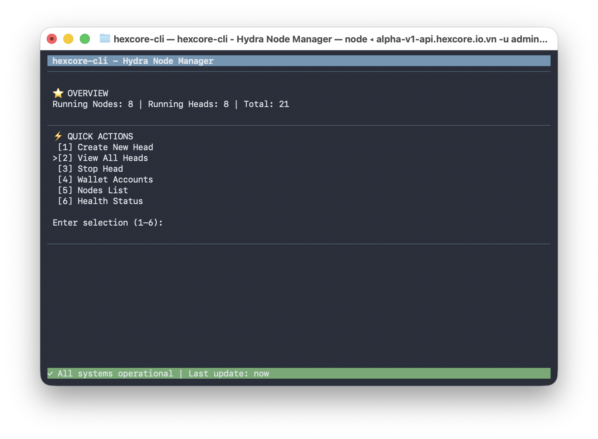

# hexcore-cli

Terminal UI for managing Hydra Nodes - A blessed-based Node.js CLI for real-time node operations.

## 🎯 Features

- **Interactive Dashboard** - Real-time overview of running nodes and heads
- **Head Management** - Create, list, and stop Hydra heads
- **Account Management** - Add and manage wallet accounts with BIP39 validation
- **Node Monitoring** - View nodes and system health status
- **Real-time Updates** - Status updates every 5 seconds
- **Keyboard Navigation** - Keyboard-driven menu (1-6 selection)

## 📦 Installation & Usage

```bash
npm install && npm run build
npm start -- start --url https://api.hexcore.io.vn -u admin -p password123
```

## Dashboard



```
 hexcore-cli - Hydra Node Manager
─────────────────────────────────
 ⭐︎ OVERVIEW
 Running Nodes: 1 | Running Heads: 3 | Total: 5
─────────────────────────────────
 ⚡︎ QUICK ACTIONS
 > [1] Create New Head
   [2] View All Heads
   [3] Stop Head
   [4] Wallet Accounts
   [5] Nodes List
   [6] Health Status

 Enter selection (1-6): 
─────────────────────────────────
 ✓ All systems operational | Last update: 2s ago
```

## 🎮 Navigation

| Key | Action |
|-----|--------|
| `1-6` | Select menu option |
| `Enter` | Confirm selection |
| `Ctrl+C` | Exit |

## Testing

```bash
npm test              # Run all tests
npm run build && npm test
```

**Status:** 27/27 tests passing

## Requirements

- Node.js >= 18.0.0
- Hydra backend API accessible

---

**Version:** 1.0.0 | **Updated:** December 16, 2025
