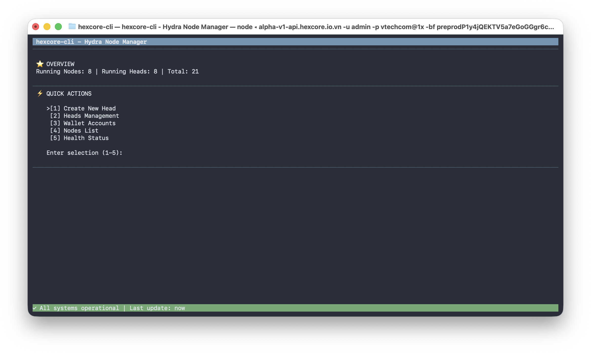
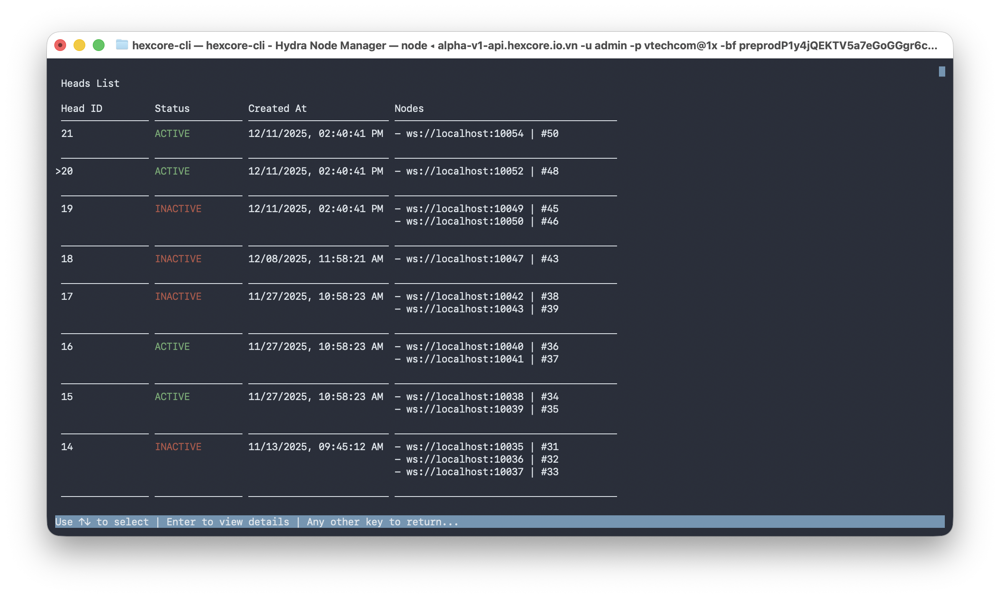
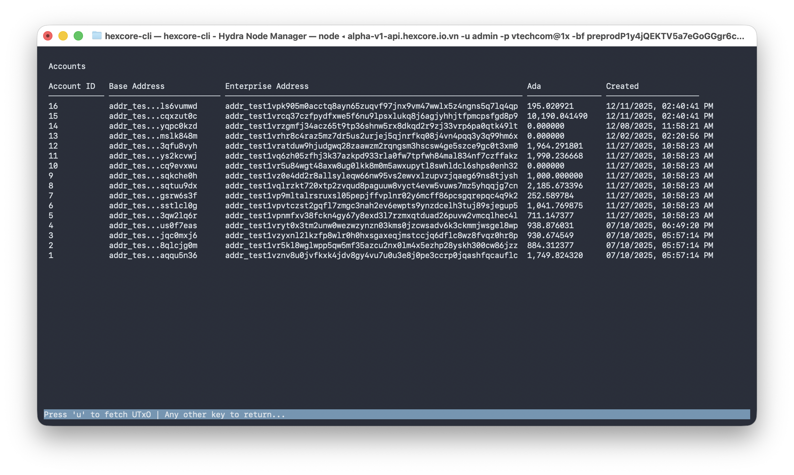

# hexcore-cli

Terminal UI for managing Hydra Nodes - A blessed-based Node.js CLI for real-time node operations.

## 🎯 Features

### Dashboard & Navigation
- **Interactive Dashboard** - Real-time overview with auto-refresh every 5 seconds
- **Keyboard Navigation** - Arrow keys (↑↓), vi-style (j/k), and number keys (1-5)
- **Smart Menu Selection** - Visual indicator (>) for current selection

### Heads Management
- **Create New Head** - Initialize Hydra heads with account selection
- **Heads List View** - Tree-style display with scrollable interface
  - Color-coded status (🟢 ACTIVE / 🔴 INACTIVE)
  - Hierarchical node display with WebSocket URLs
  - Navigate with ↑↓ keys, Enter to view details
- **Head Detail View** - Complete management interface
  - **[S]** Stop Party (`/hydra-main/deactive-party`)
  - **[C]** Clear Persistence Data (`/hydra-main/clear-party-data`)
  - **[R]** Start/Restart Party (`/hydra-main/active-party`)
  - Progress bars with spinners for all operations

### Account Management
- **List Accounts** - View all wallet accounts with base/enterprise addresses
- **Fetch UTxO** - Press 'u' to fetch UTxO data with progress tracking
- **Real-time Updates** - Auto-refresh after UTxO fetch

### Monitoring
- **Nodes List** - View all nodes with ports and account information
- **Health Status** - System-wide health check with detailed metrics

## 📦 Installation & Usage

### Development
```bash
npm install
npm run build
npm run dev -- start --url https://api.hexcore.io.vn -u admin -p password123
```

### Production Build
```bash
npm run build
npm start -- start --url https://api.hexcore.io.vn -u admin -p password123
```

### Binary Distribution
```bash
# Build for all platforms
npm run pkg:mac      # macOS (ARM64 + x64)
npm run pkg:linux    # Linux x64
npm run pkg:win      # Windows x64

# Binaries will be in release/ folder
./release/hexcore-cli-arm64 start --url https://api.hexcore.io.vn -u admin -p password123
```

## 📊 Dashboard

Example screenshot of the hexcore-cli dashboard:





```
 hexcore-cli - Hydra Node Manager
─────────────────────────────────
 ⭐︎ OVERVIEW
 Running Nodes: 5 | Running Heads: 8 | Total: 10
─────────────────────────────────
 ⚡︎ QUICK ACTIONS
 >[1] Create New Head
  [2] Heads Management
  [3] Wallet Accounts
  [4] Nodes List
  [5] Health Status

 Enter selection (1-5): 
─────────────────────────────────
 ✓ All systems operational | Last update: 2s ago
```

## 🎮 Navigation

### Main Menu
| Key | Action |
|-----|--------|
| `1-5` | Quick select menu option |
| `↑↓` / `j/k` | Navigate menu |
| `Enter` / `Space` | Confirm selection |
| `Escape` / `q` / `Ctrl+C` | Exit |

### Heads Management
| Key | Action |
|-----|--------|
| `↑↓` | Select head in list |
| `Enter` | View head details |
| `S` | Stop party (in detail view) |
| `C` | Clear persistence data |
| `R` | Start/Restart party |

### Accounts
| Key | Action |
|-----|--------|
| `u` | Fetch UTxO data |
| `Any key` | Return to menu |

## 🧪 Testing

```bash
npm test              # Run all tests
npm test:watch        # Watch mode
npm run build && npm test --silent
```

**Status:** ✅ 28/28 tests passing

## 🛠️ Technical Stack

- **UI Framework:** Blessed.js (Terminal UI)
- **Language:** TypeScript
- **HTTP Client:** Axios
- **Testing:** Vitest
- **Build:** pkg (Binary packaging)
- **Blockchain:** @hydra-sdk/core (Type definitions)

## 📋 API Endpoints

| Endpoint | Method | Description |
|----------|--------|-------------|
| `/hydra-main/login` | POST | Authenticate user |
| `/hydra-main/active-nodes` | GET | List all heads |
| `/hydra-main/hydra-nodes` | GET | List all nodes |
| `/hydra-main/list-account` | GET | List wallet accounts |
| `/hydra-main/deactive-party/:id` | POST | Stop party |
| `/hydra-main/clear-party-data/:id` | DELETE | Clear data |
| `/hydra-main/active-party/:id` | POST | Start party |

## 🎨 UI Components

- **Progress Box** - Animated spinner with progress bar
- **Scrollable Lists** - Auto-scroll with selection tracking
- **Color-coded Status** - Visual indicators for system health
- **Tree View** - Hierarchical data display

## 📦 Dependencies

- `blessed@^0.1.81` - Terminal UI framework
- `axios@^1.6.2` - HTTP client
- `commander@^11.1.0` - CLI framework
- `@hydra-sdk/core@^1.1.5` - Cardano types
- `bignumber.js@^9.3.1` - Number formatting

## 🔧 Requirements

- Node.js >= 18.0.0
- Hydra backend API accessible
- Terminal with 256 color support

---

**Version:** 0.0.1 | **License:** MIT | **Updated:** December 16, 2025
